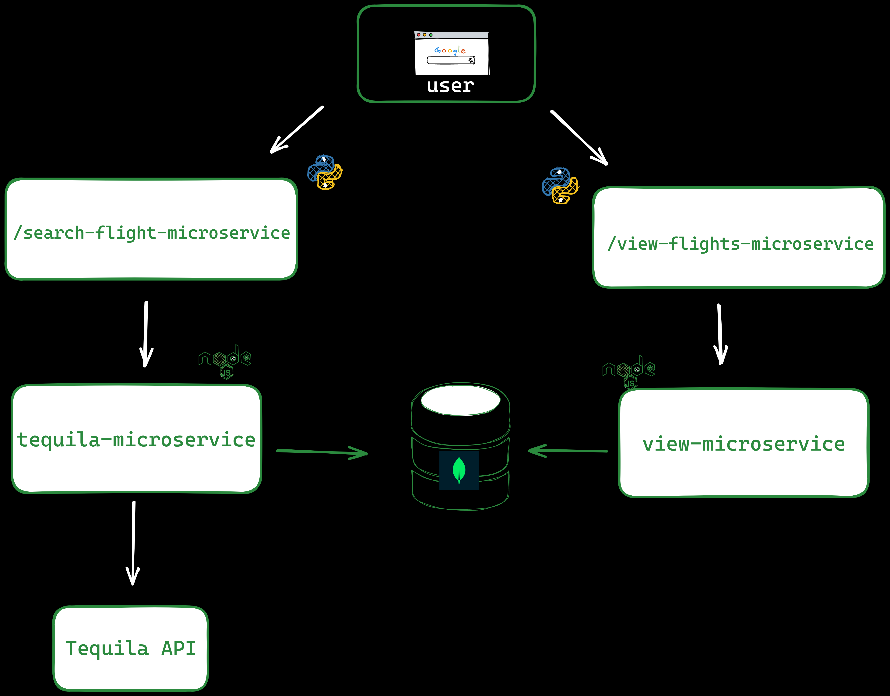

# cloud-native-kata-project

## Project Purpose

Flight Finder is a flight finding web-based micro-service application that finds cheapest flight prices for different destinations and show the user the cheapest found. Basically, the application allows the user to search and view flights.

## Contributors
1. George Abot 

## Modules Expected
Number of modules: 5

## Languages and Frameworks:
1. JavaScript
2. Node.js 
3. Express
4. Python
5. Flask
4. Html/CSS
5. MongoDB
6. Mongoose
7. Kubernetes
8. Docker

## External Services
1. Kiwi Flight Search API(Tequila API) - watch the flights prices
2. AirLabs API - resolves airlines code to airline carier name e.g "F9" -> "Frontier Airlines"

## Primary UI Features
The user can perform the following operations:

1. Search Flights 
2. View Flights
3. Add source location 
4. Add the Destination
5. Add desired flight prices
6. View the desired flight information

## Run the app in Kubernetes
To run the app in Kubernetes, Docker for Desktop Mac or Windows is required. The folder k8s-kata-specifications contains all the YAML files for the app. The app microservices should be deployed in the following order:
1. Deploy the tequila-configMap and tequila-secret. The components should be available before deploying tequila-deployment by the following command:

    kubectl apply -f tequila-configMap.yaml -f tequila-secret.yaml

2. Deploy the mongo-deployment

    kubectl apply -f mongo-depl.yaml

3. Deploy tequila-deployment 
    
    kubectl apply -f teemo-deployment.yaml

4. Deploy cache-deployment

    kubectl apply -f cache-deployment.yaml

5. Deploy search-deployment

    kubectl apply -f search-deployment.yaml

6. Deploy view-deployment

    kubectl apply -f view-deployment.yaml

Once all the services have been deployed, The search app will be running at http://localhost:5000, and the results will be at http://localhost:8080/flights.

## Flight Finder Architecture

